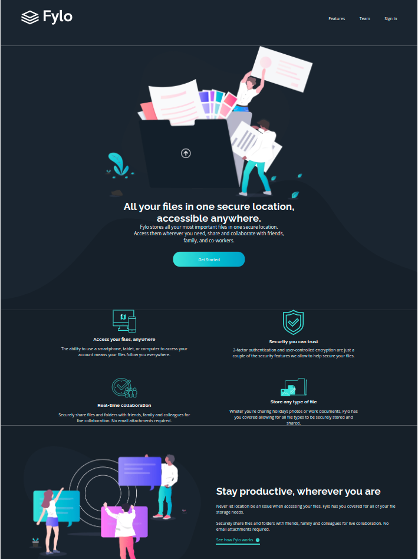

# Frontend Mentor - Fylo dark theme landing page

This is a solution to the [Frontend Mentor - Fylo dark theme landing page][frontend_challenge]. Frontend Mentor challenges help you improve your coding skills by building realistic projects.

## Table of contents

- [Overview](#overview)
    - [The challenge](#the-challenge)
    - [Screenshot](#screenshots)
    - [Links](#links)

## Overview

### The challenge

Users should be able to: 

- View the optimal layout for the component depending on their device's screen size
- Navigate the slider using either their mouse/trackpad or keyboard

### Screenshot

### Links

- Solution URL: [Solution URL ](https://github.com/NathaliaBarreiros/Fylo-Dark-Theme-Landing-Page)
- Live Site URL: [live-site] (https://nifty-joliot-753b49.netlify.app/)

[frontend_challenge]: https://www.frontendmentor.io/challenges/fylo-dark-theme-landing-page-5ca5f2d21e82137ec91a50fd
